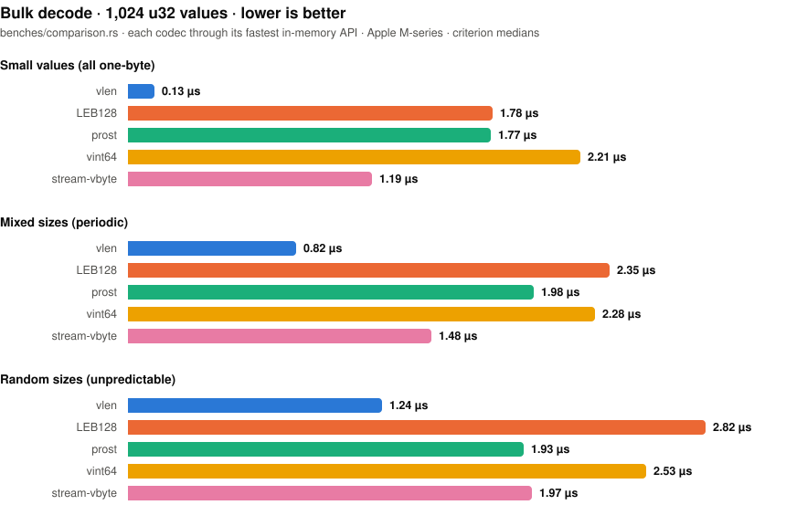

# vlen

**The fastest-decoding self-delimiting varint for Rust.** Integers and
floats up to 128 bits, smaller values in fewer bytes, zero
dependencies, zero unsafe code, `no_std`.

```rust
use vlen::{Decode, Encode};

let mut buf = [0u8; 5];
let len = 12345u32.encode(&mut buf)?;          // 2 bytes
let (value, _) = u32::decode(&buf[..len])?;    // 12345
# Ok::<(), vlen::Error>(())
```

## Why vlen

**It decodes faster than every varint we could find to compare
against — including on adversarial input.** The length lives in the
first byte instead of continuation bits spread across the value, so
decoding is one predicted branch:

<picture>
  <source media="(prefers-color-scheme: dark)" srcset="assets/benchmarks-dark.svg">
  
</picture>

Encode and single-value results from the same run, with honest losses
included:

| Benchmark (1,024 u32) | vlen | LEB128 | prost | vint64 | stream-vbyte |
|-----------------------|-----:|-------:|------:|-------:|-------------:|
| bulk encode, small values | **0.13 µs** | 0.79 µs | 0.96 µs | 1.89 µs | 0.53 µs |
| bulk encode, mixed sizes  | 0.92 µs | 1.34 µs | 1.63 µs | 2.44 µs | **0.73 µs** |
| single decode (4-byte value) | **0.67 ns** | 2.01 ns | 0.77 ns | 2.04 ns | – |
| single encode (4-byte value) | 1.56 ns | 2.00 ns | 2.61 ns | **0.80 ns** | – |

Methodology: every codec through its fastest public in-memory API over
identical data (`benches/comparison.rs`). The bulk rows and the chart
all use vlen's validating API. The single-value rows use its
infallible array API; through the validating slice API — the same
work the other crates always do — vlen measures 1.21 ns decode /
1.62 ns encode, so prost's validating decode (0.77 ns) wins that one
cell. stream-vbyte runs its scalar kernels (its SSE4.1 decoder is
faster on x86_64) and is a control-stream format rather than a
self-delimiting varint; `prost` and `vint64` are 64-bit codecs fed
the same values widened to `u64`.

Compression matches LEB128 byte-for-byte below 2^28 — where most
varint data lives — and caps at 9 bytes for `u64`, where LEB128 needs
up to 10.

**It is safe to point at untrusted bytes.** The crate contains no
unsafe code (`#![deny(unsafe_code)]`). The checked API returns typed
errors — never panics, never desynchronizes on truncated input,
invalid prefixes, or out-of-range values — and decoding needs only the
bytes a value actually occupies.

**It runs everywhere, at compile time too.** The core is dependency-
free `no_std` (CI builds it for `thumbv7em-none-eabi`), and every
array-based codec function is `const fn`:

```rust
const LEN: usize = {
    let mut buf = [0u8; 5];
    vlen::encode_u32(&mut buf, 12345)
};
```

**One wire format across all widths.** A value encoded as `u16`
produces the same bytes as `u32`, `u64`, or `u128`, and decodes at any
width that can hold it — no cross-type surprises when a field grows.

**Bulk operations that exploit your data's shape.** The specialized
bulk functions detect runs of similarly-sized values and move them
without per-value length arithmetic — up to 4x faster than the
per-value loop on small-value streams, in portable safe Rust on every
architecture. A `decode_iter` streaming iterator handles streams of
unknown length:

```rust
use vlen::{bulk_encode, decode_iter};

let values = [1u64, 250, 70_000, u64::MAX];
let mut buf = [0u8; 36];
let len = bulk_encode(&mut buf, &values)?;

let decoded: Result<Vec<u64>, vlen::Error> =
    decode_iter(&buf[..len]).collect();
assert_eq!(decoded?, values);
# Ok::<(), vlen::Error>(())
```

**Serde that respects your format.** With the `serde` feature, the
`Vlen*` wrapper types hand binary formats (postcard, bincode, ...) the
raw encoded bytes and human-readable formats (JSON, ...) base64 —
allocation-free either way, hostile input rejected with errors.

## Features

| Feature | Adds |
|---------|------|
| `alloc` | `Vec` conveniences: `encode_to_vec`, `bulk_encode_to_vec`, `bulk_decode_values` |
| `serde` | `Vlen*` wrapper types (allocation-free, `no_std`) |
| `full`  | Everything above |

MSRV: **1.85**. Tested in CI on x86_64 and aarch64, stable and MSRV,
with clippy, rustfmt, and `no_std` builds gating every change.

## When something else fits better

If your workload is purely columnar bulk `u32` compression — no
streaming, no self-delimiting values — a control-stream format like
`stream-vbyte` can encode mixed-size batches faster. vlen is built for
the general case: self-delimiting streams you can read value by value.

## Learn more

- [API documentation](https://docs.rs/vlen)
- [DESIGN.md](DESIGN.md) — wire format specification and performance
  design notes
- [CHANGELOG.md](CHANGELOG.md) — release notes and migration guides

## License

MPL-2.0 — see [LICENSE](LICENSE). Based on the original `vu128`
implementation by John Millikin (attribution in
[LICENSE-VU128.txt](LICENSE-VU128.txt)), with performance improvements
and enhancements by Harrison Chin.
